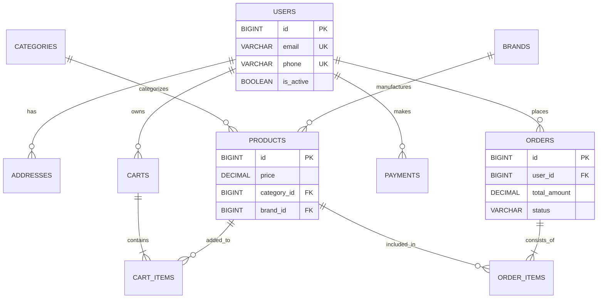

# E-Commerce Database Schema

A production-ready PostgreSQL database schema for a full-featured e-commerce platform with automated one-click deployment via GitHub Actions.

## 📋 Project Overview

This repository contains:
- **SQL Migration Files**: Numbered, ordered PostgreSQL DDL scripts for creating the complete e-commerce schema
- **GitHub Actions Workflow**: Automated deployment pipeline for one-click database migrations
- **Production Best Practices**: Indexes, constraints, comments, and scalability considerations

### ER Diagram Reference

The schema implements the following entities:
- `users` - Customer and admin accounts
- `addresses` - Shipping and billing addresses
- `categories` - Hierarchical product categories
- `brands` - Product brands
- `products` - Product catalog with pricing and inventory
- `carts` - User shopping cart sessions
- `cart_items` - Items in shopping carts
- `orders` - Customer order records
- `order_items` - Line items within orders
- `payments` - Payment transaction records

## 🏗 Database Architecture

### Entity Relationship Diagram (ERD)



### Scalability & Design Notes

### Prerequisites

1. A PostgreSQL database instance (self-hosted, RDS, Cloud SQL, etc.)
2. GitHub repository with admin access

### Setup GitHub Secrets

Navigate to your repository → **Settings** → **Secrets and variables** → **Actions** → **New repository secret**

| Secret Name | Description | Example Value |
|-------------|-------------|---------------|
| `DB_HOST` | Database hostname | `db.example.com` or `mydb.rds.amazonaws.com` |
| `DB_USER` | Database username | `postgres` or `admin` |
| `DB_PASS` | Database password | `your_secure_password` |
| `DB_NAME` | Database name | `ecommerce_db` |

### Manual Deployment (Workflow Dispatch)

1. Go to **Actions** tab in your GitHub repository
2. Select **"Deploy Database Migrations"** workflow
3. Click **"Run workflow"**
4. Choose environment (production/staging)
5. Click **"Run workflow"** button

### Automatic Deployment

Migrations automatically run on every push to the `main` branch.

## 📁 Migration Files

Migrations are located in the `/migrations` directory and are executed in alphabetical order:

| File | Description |
|------|-------------|
| `001_create_users.sql` | Users table with authentication fields |
| `002_create_addresses.sql` | User addresses with default flag |
| `003_create_categories.sql` | Hierarchical product categories |
| `004_create_brands.sql` | Product brands |
| `005_create_products.sql` | Product catalog with pricing |
| `006_create_carts.sql` | Shopping cart sessions |
| `007_create_cart_items.sql` | Cart line items |
| `008_create_orders.sql` | Order records with status tracking |
| `009_create_order_items.sql` | Order line items (denormalized) |
| `010_create_payments.sql` | Payment transactions |

### Running Migrations Locally

```bash
# Set environment variables
export PGPASSWORD="your_password"

# Run all migrations
for file in migrations/*.sql; do
  psql -h localhost -U postgres -d ecommerce_db -f "$file"
done
```

Or run individual migrations:
```bash
psql -h localhost -U postgres -d ecommerce_db -f migrations/001_create_users.sql
```

## 🏗️ Schema Design Choices

### Data Types
- **BIGINT/BIGSERIAL**: All primary keys use BIGINT to support billions of records
- **DECIMAL(12,2)**: All monetary values use DECIMAL to avoid floating-point precision issues
- **TIMESTAMP WITH TIME ZONE**: All timestamps stored in UTC for consistency across timezones
- **VARCHAR vs TEXT**: VARCHAR for fixed-length fields (email, slug), TEXT for variable content (descriptions)
- **BOOLEAN**: Used for flags (is_active, is_default)

### Constraints
- **PRIMARY KEY**: All tables have BIGSERIAL primary keys
- **FOREIGN KEY**: Referential integrity with appropriate ON DELETE actions
- **UNIQUE**: Enforced on email, phone, slug, transaction_id, order_number
- **CHECK**: Validations on prices (>= 0), quantities (> 0), status enums

### Indexes
All recommended indexes are created for:
- Fast lookups on foreign keys
- Unique constraint enforcement
- Query optimization on frequently filtered columns
- Composite indexes for common query patterns

## 📈 Scalability Considerations

### Partitioning Recommendations
| Table | Strategy | Threshold |
|-------|----------|-----------|
| `users` | Range partition by `created_at` | > 100M records |
| `products` | Range/Hash by `category_id` or `created_at` | > 50M records |
| `orders` | Range by `created_at` | > 10M records/year |
| `order_items` | Range by `created_at` (with parent orders) | High volume |
| `payments` | Range by `created_at` | High volume |

### Read Replicas
Consider adding read replicas for:
- Product listing queries (`products`, `categories`, `brands`)
- Order history lookups (`orders`, `order_items`)
- Analytics and reporting queries

### Archival Strategy
- **Carts**: Archive abandoned carts after 90 days
- **Orders**: Move completed orders older than 2 years to cold storage
- **Logs**: Implement log rotation and archival

### Caching Layer
- **Redis**: Cache active shopping carts, session data
- **CDN**: Cache product images, category pages
- **Application-level**: Cache frequently accessed reference data (categories, brands)

### Future Enhancements
1. **Full-text search**: Add GIN indexes on `products.name` and `products.description`
2. **Geocoding**: Add lat/lng columns to `addresses` for delivery optimization
3. **Audit logging**: Add triggers for change tracking on sensitive tables
4. **Soft deletes**: Implement consistent soft-delete pattern across all tables

## 🔐 Security Notes

- **PCI Compliance**: Never store raw credit card data. The `payments` table only stores gateway references.
- **Password Hashing**: Store bcrypt/argon2 hashes in `users.password_hash`, never plain text.
- **Environment Variables**: Use GitHub Secrets for database credentials; never commit `.env` files.
- **SSL/TLS**: Enable SSL for database connections in production.

## 🛠️ Troubleshooting

### Connection Issues
```bash
# Test connection manually
psql -h $DB_HOST -U $DB_USER -d $DB_NAME -c "SELECT 1;"
```

### Migration Failures
1. Check GitHub Actions logs for specific error messages
2. Verify database credentials in secrets
3. Ensure database user has CREATE TABLE and INDEX permissions
4. Check network/firewall rules allow GitHub Actions IP ranges

### Schema Validation Errors
The workflow includes post-deployment validation. If it fails:
1. Review which validation step failed
2. Check if previous migrations partially executed
3. Manually verify table existence and constraints

## 📄 License

MIT License - See LICENSE file for details.

## 🤝 Contributing

1. Create a new migration file with the next sequential number
2. Test migrations locally before committing
3. Update this README if adding new tables or significant changes
4. Submit a pull request for review

---

**Built with ❤️ for scalable e-commerce platforms**
